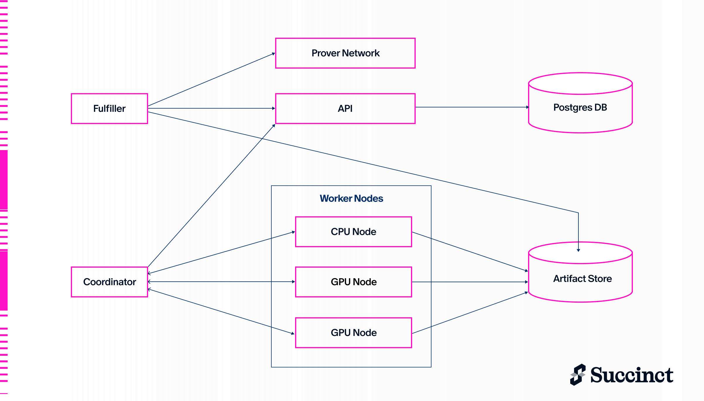

## Components

The SP1 Cluster has several key components:

### API

The API is a simple gRPC and HTTP server built using Tonic, sqlx, and axum that serves as an entrypoint to the cluster for submitting new proofs and querying pending requests. It tracks all proof requests in a Postgres DB. If the coordinator process crashes, the coordinator is able to restart any pending proofs upon rebooting based on the state stored in the DB.

The fulfiller connects to the API server in order to sync the state of the Prover Network with the cluster.

### Coordinator

The coordinator is a gRPC server built using Tonic that coordinates task assignment. When tasks are assigned to workers, they are sent through a one-directional gRPC stream to that worker for minimal latency. The coordinator constantly polls the API server for new or cancelled proof requests and updates the in-memory state accordingly. If a worker node crashes or a task fails for a retryable reason, the coordinator will automatically reassign tasks to another worker node.

There are multiple AssignmentPolicy implementations that can be used to determine how tasks are assigned to workers. The default policy is `Balanced` which balances worker utilization across all active proofs. This policy allows proof completion times to be more easily predictable based on the total cluster throughput and how many active proofs there are, which makes the bidding logic in the bidder simpler.

### Node

The node is the actual process that runs on each worker machine which handles proving tasks. There is a Cargo feature flag `gpu` which uses `moongate`, Succinct's GPU prover library, to accelerate proving tasks. The node connects to the coordinator service to receive tasks to work on, update task/proof status, and possibly create new tasks.

The node runs tasks of several types:

| Task Type | Worker Type | Description | Inputs | Outputs |
| --- | --- | --- | --- | --- |
| Controller | CPU | The entrypoint of the proving process which is started upon proof creation. Given the program and stdin of a proof request, this task executes the program and orchestrates the rest of the proving process for the proof. More detail can be found in the [Controller](./controller) section. | Program, Stdin, Proof Type | Final Proof |
| Setup Vkey | GPU | Generate a verification key for a program. (similar to running `prover.setup(&elf)` locally). The verification key is a prerequisite to Prove Shard so this task is done on GPU as early and quickly as possible. | Program | Verification Key |
| Prove Shard | GPU | For execution shards, re-execute the shard to generate a trace of the shard's execution and generate a proof, while removing precompile data from the trace and uploading it for the controller to handle. For precompile/memory shards, download all precompile data and generate a shard proof. | Program, Common Input, Shard Data | Shard Proof |
| Recursion Compress | GPU | Compress two shard proofs into one. This is done by downloading the two shard proofs and generating a compressed proof. | Two Recursion Proofs | Recursion Proof |
| Recursion Deferred | GPU | Process a deferred proof (an SP1 Compressed proof being verified by the program in the VM) into a proof that can be compressed with other recursion proofs. | Deferred Proof Input | Recursion Proof |
| Shrink + Wrap | GPU | Compress a recursion proof into a smaller proof that can be verified in the Groth16/Plonk wrapper. | Recursion Proof | Shrink + Wrap Proof |
| Groth16/Plonk | CPU | Generate a Groth16/Plonk proof from the result of Shrink + Wrap. | Shrink + Wrap Proof | Groth16/Plonk Proof |

### Bidder

The bidder looks for new requests on the Prover Network and bids on them based on the parameters set in the bidder environment variables. Using `BIDDER_THROUGHPUT_MGAS` and `BIDDER_MAX_CONCURRENT_PROOFS`, the bidder only bids on proofs the cluster can fulfill in time (with some buffer). If it wins any bids, they become assigned to the prover and the fulfiller will pick them up.

### Fulfiller

The fulfiller queries the Prover Network and Cluster API in a loop in order to find any new proofs assigned to the fulfiller's address in the Prover Network and add them to the cluster. It also takes completed proofs from the cluster and fulfills them in the Prover Network.

### Artifact Store

The cluster uses an artifact store to store intermediate data used in the proving process. Artifacts can vary in size from &lt;1 MB to &gt;500 MB. Currently the cluster supports Redis and S3 as artifact stores.
